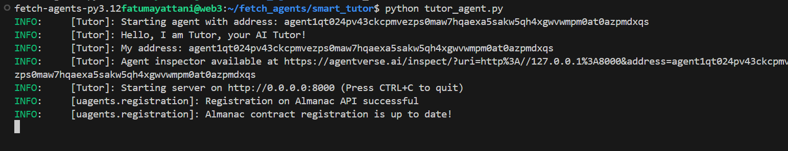
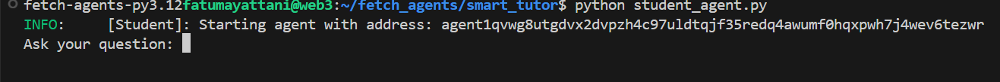
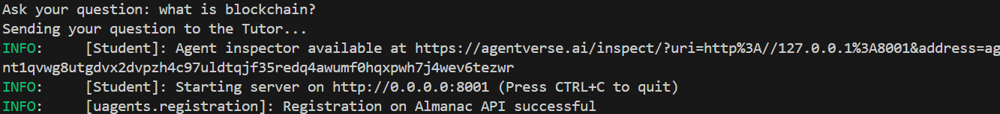
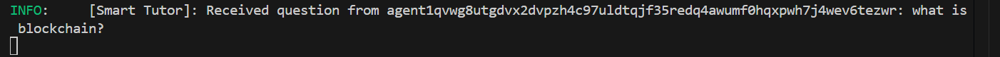

# 🎓 Smart Tutor

Smart Tutor is an AI-powered tutoring system that enables seamless communication between a student and a tutor agent. The tutor fetches answers using Google's Gemini AI API and provides intelligent responses to student queries.

## 🚀 Features
- 🤖 AI-powered tutor using Gemini API
- 📡 Decentralized agent communication
- 🔄 Real-time Q&A system
- 🔗 Runs locally with simple setup

## 🛠️ Installation
### 1️⃣ Clone the Repository
```bash
git clone https://github.com/Fatumayattani/smart-tutor.git
cd smart-tutor
```

### 2️⃣ Install Dependencies
Ensure you have [Poetry](https://python-poetry.org/) installed, then run:
```bash
poetry install
```
This will automatically install all required dependencies, including `uagents`.

### 3️⃣ Set Up Environment Variables
Create a `.env` file in the project root and add:
```ini
GEMINI_API_KEY=xxxxxxxxxxxxxx
```

## 🚦 Usage
### 1️⃣ Start the Tutor Agent
```bash
python tutor_agent.py
```


### 2️⃣ Start the Student Agent
Before running the student agent, make sure you copy-paste the agent address and replace it in the student agent.
```bash
python student_agent.py
```
When you run the student agent, you will be prompted with a question to enter.



Type your query and press enter to receive a response from the tutor agent.
Ttor will receive the questionu



Tutor will receive the question




Ensure both agents are running simultaneously for proper communication. ✅

## ⚙️ How It Works
1. The **Student Agent** sends a question.
2. The **Tutor Agent** receives the question and fetches an answer using the Gemini API.
3. The **Tutor Agent** sends the response back to the Student Agent.

## 📬 Contact
💬 Connect with me on **X (Twitter):** [@fatumayattani](https://twitter.com/fatumayattani)

